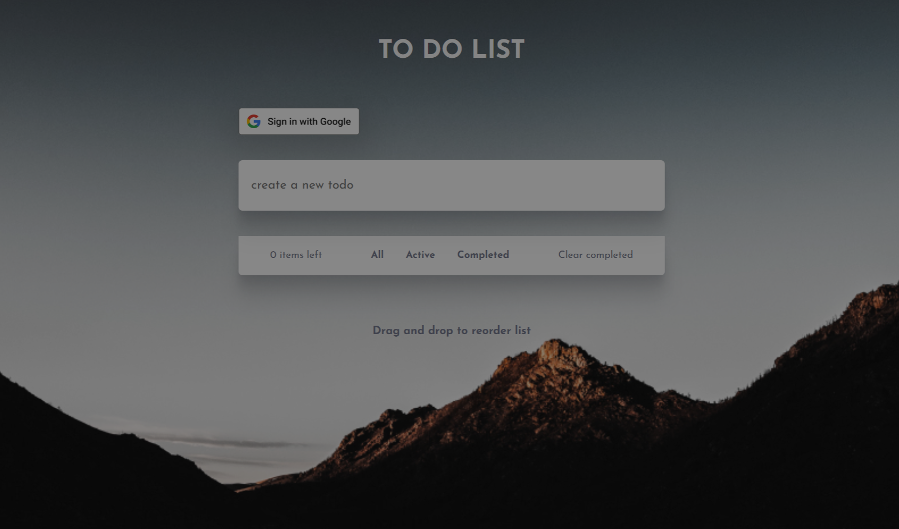
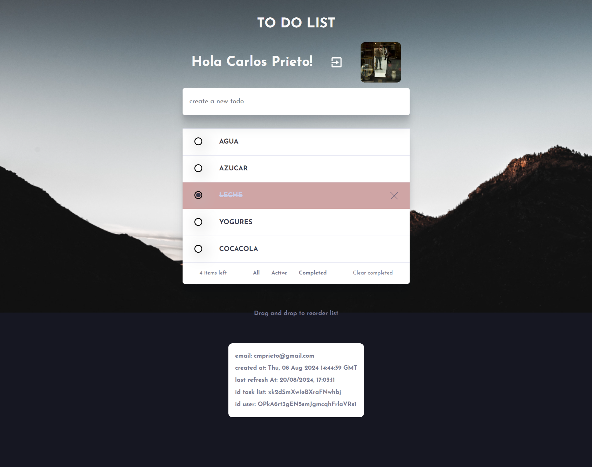

# Todo app - aplicación de listado de tareas. 

## Introducción


[Frontend Mentor](https://www.frontendmentor.io) challenges help you improve your coding skills by building realistic projects.

## Descripción del proyecto
Esta es una aplicación de lista de tareas que permite a los usuarios agregar, eliminar y marcar
tareas como completadas.
Al desarrollo de la aplicación propuesta por FrontEndMentor le he agregado varias características:
- Drag and drop -arrastrar y reordenar- los items de la lista con react-beautiful-dnd.
- Autenticación con Google para recuperar la lista creada previamente.
- Creación de una cuenta para poder guardar la lista de tareas en la base de datos de Firebase.

## Características
- **Autenticación con Google**: La aplicación permite a los usuarios conectarse con su cuenta de
Google para recuperar la lista de tareas creada previamente y almacenar la lista en la BBDD de Firebase.
- **Agregar tareas**: Los usuarios pueden agregar tareas a la lista.
- **Eliminar tareas**: Los usuarios pueden eliminar tareas de la lista.
- **Marcar tareas como completadas**: Los usuarios pueden marcar tareas como completadas.
- **Filtrar las tareas**: Mostrar todas las tareas, las activas o las completadas. 
- **Reordenar tareas**: Los usuarios pueden reordenar las tareas en la lista
- **Eliminar las tareas completadas en lote**: Los usuarios pueden eliminar en lote todas tareas completadas de la lista.
- **Guardar lista en Firebase**: La lista de tareas se guarda en la base de datos de
Firebase para que los usuarios puedan recuperarla en cualquier momento, siempre y cuando se haga la autenticación.
- **Funcionamiento de la aplicación sin autenticación**: Mantiene todas las características con la única diferencia de no poder guardas las tareas en remoto. 
- **Requerimientos**: La aplicación debe ser compatible con dispositivos móviles y
desktops. 

## Tecnologías Utilizadas
- **React**: Biblioteca de JavaScript para construir interfaces de usuario.
- **React Context**: Para pasar datos a través del árbol de componentes sin tener que pasar props manualmente en cada nivel.
- **React-beautiful-dnd**: Añade la característica de drag and drop -arrastrar y soltar- a las tareas de la lista.
- **Firebase**: Base de datos en la nube para guardar la lista de tareas.
- **Firebase - Google Authentication**: Para la autenticación con Google.
- **SASS en React,** **Grid, Flexbox,** **CSS3** y **HTML5**: Para el diseño y estructura de la aplicación.
- **BEM**: metodología de nomenclatura y estructura de código CSS. Ayuda a reutilizar estilos, facilita el mantenimiento y hace que los estilos sean más escalables en proyectos web.  

## Estructura de archivos
```
react-todo/
├── public/
│   ├── index.html
│   └── ...
├── src/
│   ├── app/
│   │   ├── firebase.js
│   │   └── signInWithGoogle.js
│   │   ├── api.js
│   │   └── apiFirebaseUsers.js
│   ├── components/
│   │   ├── TodoContainer.js
│   │   ├── TodoContainerList.js
│   │   ├── TodoContainerListComponent.js
│   │   └── ...
│   ├── App.js
│   ├── index.js
│   ├── providers/
│   │   └── UserProvider.js
│   ├── scss/
│   │   ├── _variables.scss
│   │   ├── _mixins.scss
│   │   └── ...
│   │   └── main.scss
│   │   └── ...
│   └── ...
├── .env
├── package.json
└── README.md

```
## Uso
- Autenticarse con tu cuenta de Google a través de una ventana pop-up.
- Visualización de tu nomnbre y foto de perfil de Google para personalizar la experiencia.
- Una vez autenticado, puedes crear tareas y guardarlas en la base de datos de Firebase.
- Puedes ordenar las tareas según tu preferencia mediante el drag and drop.
- Puedes eliminar tareas de la lista.
- Puedes ver las tareas que has creado en la base de datos de Firebase.
- Marcar las tareas como completadas, filtrarlas según estén activas o completadas.
- Borrado por lotes de todas las tareas completadas.
- Al volver a autenticarte se recupera la lista de tareas tal y como se haya guardado.

`